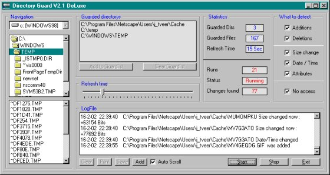



## DirGuard deLuxe

### Description

Well here it is, Dirguard de Luxe, as i could not find beta-testers i could only test it on WinNT and win98Se.

Now guarding multiple directory's, just ad them to the guardlist and all files within are guarded.

Solved the syncronisation of different boxes in previous versions by using a FlexGrid to store the information, i never used Flex-Grid so the code might be somewhat "unusual".

Now guarding for : additions, deletions, changes of date, time, attribute and size, also checks if a file can be accessed.

The logfile got autoscroll and there is something done about the visualisation of the guarding, again the code might seem a bit exotic here and there.

Feedback or a rating would be great, also beta-testers but hey...you can always improve it yourselfe but please inform me about your ideas.

(CPU-load while checking 700 files is 19% max)
 
### More Info
 
NEVER guard the C:\ root-directorie !.

Much files are not accesable or will let the computer crash (saveguard against this is incorporated in the program)

             |
---                |---
**Submitted On**   |2002-02-16 22:41:50
**By**             |[Cybsoft](https://github.com/Planet-Source-Code/PSCIndex/blob/master/ByAuthor/cybsoft.md)
**Level**          |Intermediate
**User Rating**    |5.0 (35 globes from 7 users)
**Compatibility**  |VB 5\.0, VB 6\.0
**Category**       |[Files/ File Controls/ Input/ Output](https://github.com/Planet-Source-Code/PSCIndex/blob/master/ByCategory/files-file-controls-input-output__1-3.md)
**World**          |[Visual Basic](https://github.com/Planet-Source-Code/PSCIndex/blob/master/ByWorld/visual-basic.md)
**Archive File**   |[DirGuard\_d556412162002\.zip](https://github.com/Planet-Source-Code/cybsoft-dirguard-deluxe__1-31858/archive/master.zip)

